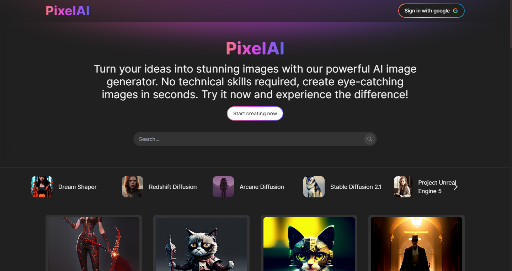

# AI Image Generation (PixelAI)
PixelAI is an application that uses artificial intelligence to generate images from text.

## Features

- Text-to-image generation
- Share generated images in a gallery.
- User management
- Create images with predefined models.


## Installation

Install my project with npm

```bash
  npm install AI-image-generation
  cd AI-image-generation
```
    
## Environment Variables

To run this project, you will need to add the following environment variables to your .env file


**Frontend:**
```
VITE_GOOGLE_CLIENT_ID
VITE_SERVER
```

**Backend:**
```
PORT
SD_API_Key
MONGODB_CNN
GOOGLE_CLIENT_ID
GOOGLE_SECRET_ID
FACEBOOK_APP_ID
FACEBOOK_APP_SECRET
CLOUDINARY_CLOUD_NAME
CLOUDINARY_API_KEY
CLOUDINARY_API_SECRET
COOKIE_SECRET
CLIENT_URL
```
## Demo

[Live Demo](https://pixelai.vercel.app/) 😎


## Screenshots




## Tech Stack

**Client:** React, Typescript, Redux, TailwindCSS

**Server:** Node, Express, MongoDB


## Feedback

If you have any feedback, please reach out to us at guiller.zeva16@gmail.com


## License

[MIT](https://choosealicense.com/licenses/mit/)

